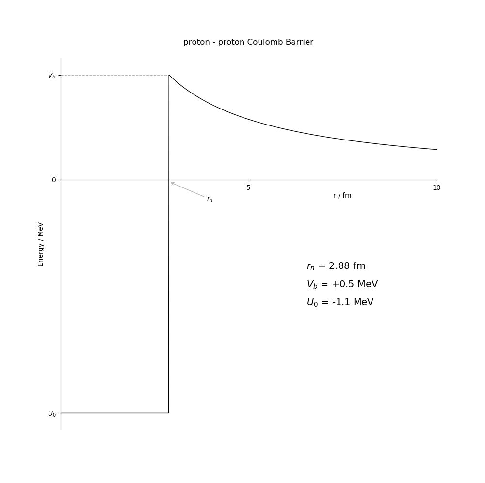

# Stellar Fusion

## AIM - Explain why we use different units when dealing with particles, describe binding energy, explain the process of fusion with calculations.

**Predict**

Have a think about these questions and make some predictions! Be sure to tell someone else what you predict.

1) How much energy would it take to hold two protons together?  
2) Does fusing all atoms release energy?  
3) How hot does the sun have to be for fusion to occur?

## Intro

Intro to Nuclear Fusion in stars.

**BE.py** creates binding energy plots like the one below.

**CB.py** creates this image of the proton proton Coulomb barrier.

**mass16.csv** was pre-processed from data by the Atomic Mass Data Center ([AMDC](http://amdc.impcas.ac.cn/filel.html)).
**mass16Abundant.csv** is the same but with only the most abundant isotope of each element (pre-processed by hand - not sure why - using the pdfs).

The three pdfs contain further reading/are references that I used and link in the code and notebook.