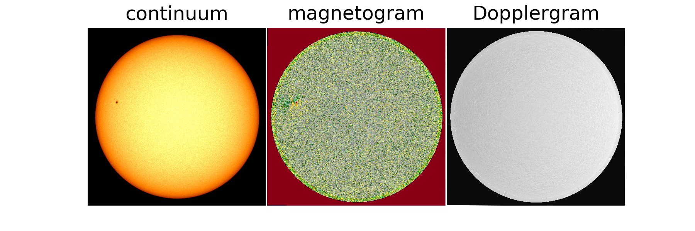
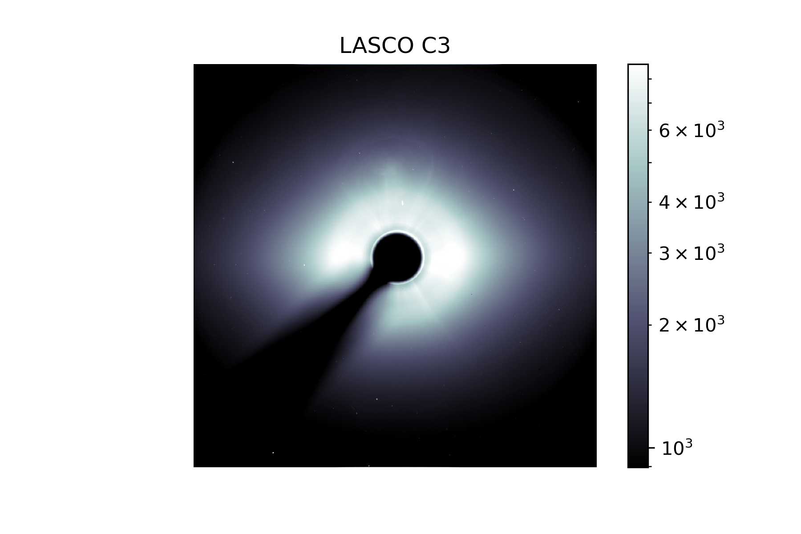

# Solar Images

***Note*** - doesn't seem to work on tryJupyter due to glymur and SunPy dependencies. Works well on local environment and custom JupyterHub env!

## AIM - To access image data on the sun and visualise it in different wavelengths

**Predict**

Have a think about these questions and make some predictions! Be sure to tell someone else what you predict.

1) Do you think the sun looks the same in all wavelengths?  
2) Are there parts of the sun we can only see in certain wavelengths?    
3) How do astronomers deal with such a large amount of data?  

## Intro

Getting data from SDO and SOHO using the SunPy module.

**solarImages.py** creates all the images.

The lasco data is separate because it's not in the standard FITS format.

Some images you can make with the code:

SDO AIA:

SDO HMI:

SOHO LASCO C3:

