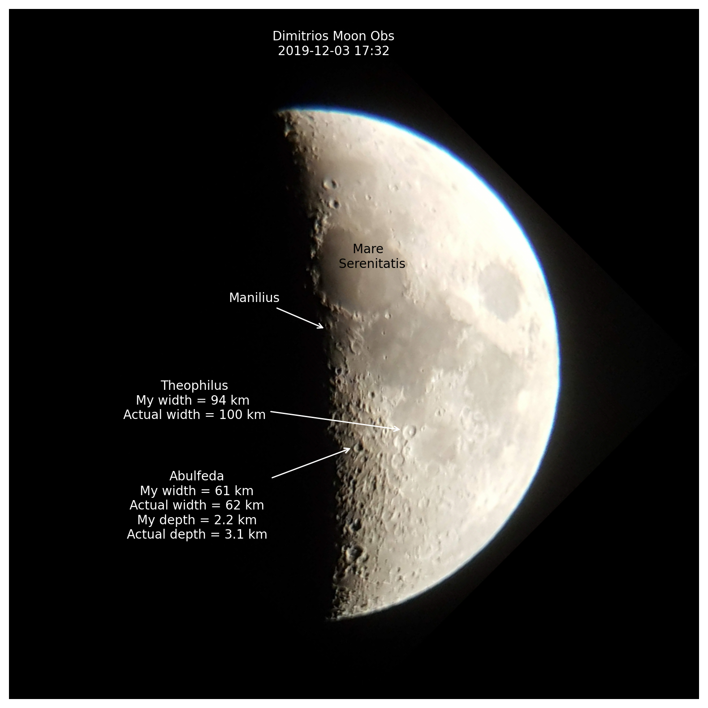
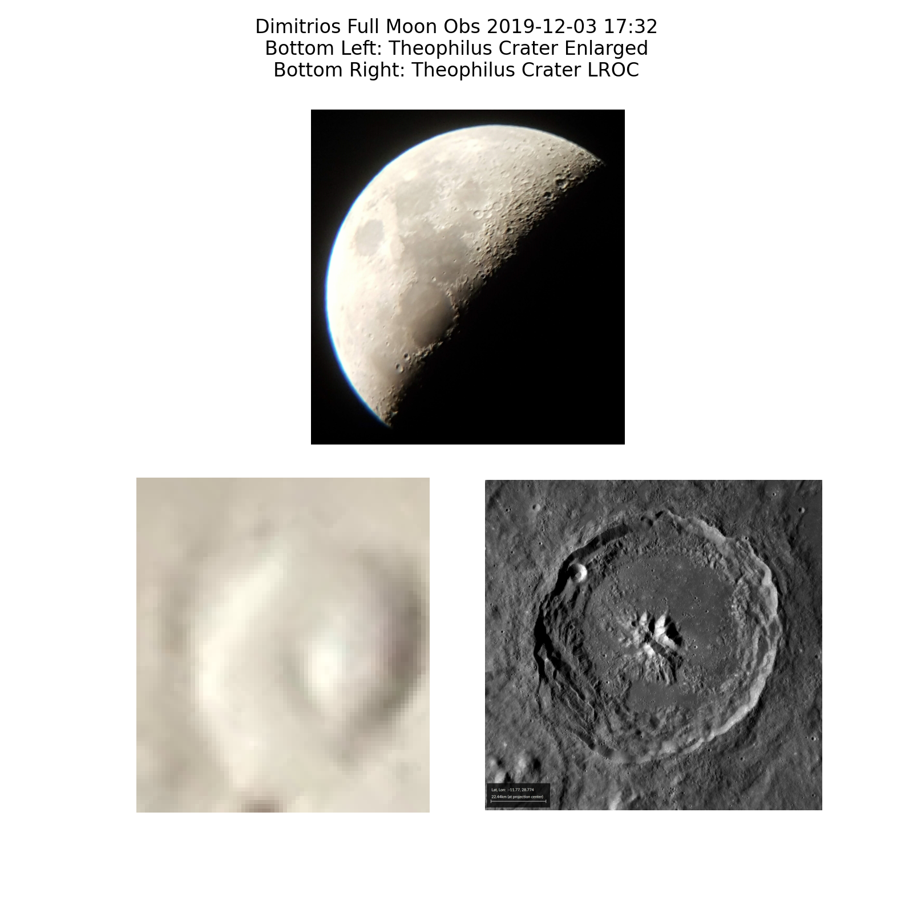
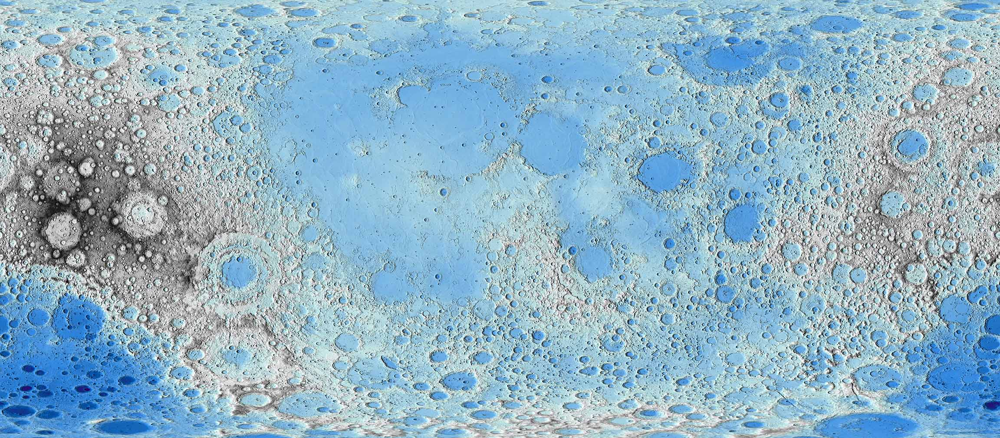

# Lunar Surface

## lunar.ipynb
## AIM - To compare our Moon image to known data and calculate some feature sizes

**Predict**

Have a think about these questions and make some predictions! Be sure to tell someone else what you predict.

1) Do the near and far sides of the Moon look the same?    
2) What sort of surface features do you think you can find on the Moon?    
3) How do we measure the height of the Moons surface?

## Intro

Annotating your image of the Moon based off known data.
Calculating crater heights and depths by first calculating our telescope/camera setups resolution.
Comparing your image to Lunar Reconnaissance Orbiter (LRO) and Lunar Orbiter Laser Altimeter (LOLA) data.

**lunar.ipynb** is the main code.

**lunar.yml** is a basic env setup that I used to test the code.

Example output - annotated lunar image


Example output - crater comparison


LROC/LOLA Digital Elevation Model made using GMT


Gif of the catalan crater topography using LOLA data


**catalan.py** in the ***catalan*** directory creates the gif of the Catalan crater topography using LOLA data stored in ***RDR_272E273E_46p130529S45SPointPerRow_csv_table***. Images used to make the gif outputted by this python script are also in the directory ***catalan***. This data is large so is stored on my drive [here](https://drive.google.com/drive/folders/1kXCnfm2d2YGzs8HBQrQYu388HK6nvkzc?usp=sharing) since it is extra data which the acitivity doesn't require to run.

## Challenge

1) Change the code we used to calculate width and depths of craters to use x,y points to calculate distance as described above  
2) Have a go at processing the included LOLA data on the Catalan crater  
3) Change the code to use the method described in the University of Exeter reference to calculate depths which doesn't rely on the small angle approximation  

Here is a code snippet you could add after the first calls to SkyField to get the [sub Earth](https://rhodesmill.org/skyfield/planetary.html#computing-lunar-libration) and sub Solar points on the moon for the Exeter method. I have added an ***exeter.py*** file with this code snippet and the lines after which calculate the height with this method (you get more accurate heights!).

```
sun = eph['sun']

p = (earth - moonSky).at(t)
latSubE, lonSubE, distanceSubE = p.frame_latlon(frame)
lonSubE_degrees = (lonSubE.degrees - 180.0) % 360.0 - 180.0
print('sub-Earth point latitude: {:.3f}'.format(latSubE.degrees))
print('sub-Earth point longitude: {:.3f}'.format(lonSubE_degrees))

p2 = (sun - moonSky).at(t)
latSubS, lonSubS, distanceSubS = p2.frame_latlon(frame)
lonSubS_degrees = (lonSubS.degrees - 180.0) % 360.0 - 180.0
print('sub-Solar point latitude: {:.3f}'.format(latSubS.degrees))
print('sub-Solar point longitude: {:.3f}'.format(lonSubS_degrees))
```

4) HARD - Have a go at looking at or processing LRO/LOLA data with GMT and the PDS Geoscience Node

# References

Resolution of ccd/telescope, Astronomy Tools, https://astronomy.tools/calculators/ccd_suitability  
Depth of Craters - Univeristy of Iowa, http://astro.physics.uiowa.edu/ITU/labs/observational-labs/studying-the-moon/measure-the-height-of-lunar/  
Crater Diameters - University of Exeter, http://www.astro.ex.ac.uk/obs/experiments/lunar/script.html (an archived version of this webpage is present in this directory) 

Lunar Orbital Data Explorer, PDS Geosciences Node - Washington University, https://ode.rsl.wustl.edu/moon/index.aspx    
JMARS Tool, https://jmars.mars.asu.edu/  
Lunar Reconnaissance Orbiter, http://lroc.sese.asu.edu/  
Lunar Orbiter Laser Altimeter, https://lola.gsfc.nasa.gov/

## Acknowledgements

Thanks to [Dr. John Keller](https://science.gsfc.nasa.gov/sed/bio/john.w.keller) for his guidance towards the GMT tool and processing of LOLA .IMG data files.

Thanks also to Brandon Rhodes author of the [SkyField](https://rhodesmill.org/skyfield/) package for advice on calculating sub-Earth and sub-Solar points on the Moon.