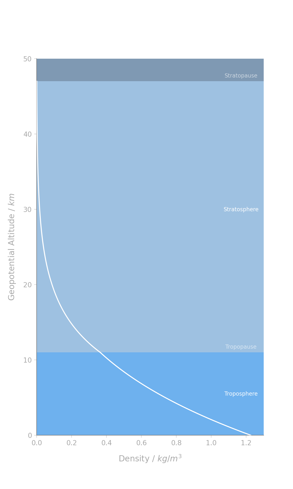
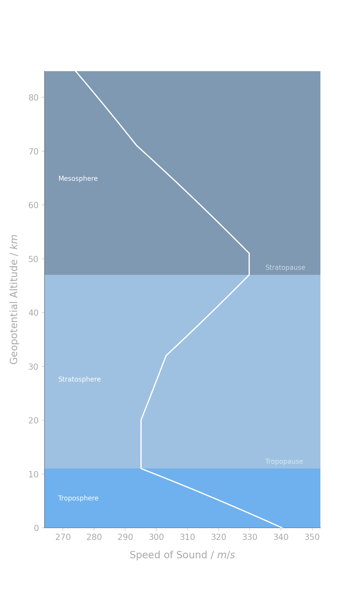

# Earth's Atmosphere

## earth_atmosphere.ipynb
## AIM - Explore the Earth's atmospheric structure and the International Standard Atmosphere (ISA) model

**Predict**

Have a think about these questions and make some predictions! Be sure to tell someone else what you predict.

1) How does temperature vary with height in the atmosphere?  
2) Where does the atmosphere end and space begin?  
3) How many layers are there in the atmosphere?

## Intro

Plotting how temperature, pressure, density, and the speed of sound vary vs altitude.

**earth_atm.py** creates my four plots although I made a mistake when calculating the pressure and density in the upper stratosphere (so the numbers are off a little and there is a slight discontinuity at the Tropopause in one of the images) however I am in no rush to correct this and have left it as a challenge for students.

## Challenge

1) Calculate the Pressure and Density to the top of the Mesosphere and plot them.  
2) Make your plots more readable - check out one of mine by loading it in the last cell block.  
3) Correct the air density based on humidity see [here](http://www-mdp.eng.cam.ac.uk/web/library/enginfo/aerothermal_dvd_only/aero/atmos/atmos.html).

## References

AMS - Geopotential Height [http://glossary.ametsoc.org/wiki/Geopotential_height](http://glossary.ametsoc.org/wiki/Geopotential_height)  
Mick Pope - Geopotential Height [https://www.youtube.com/watch?v=doQUsfrxV_Q](https://www.youtube.com/watch?v=doQUsfrxV_Q)  
AMS - Acceleration due to Gravity [http://glossary.ametsoc.org/wiki/Acceleration_of_gravity](http://glossary.ametsoc.org/wiki/Acceleration_of_gravity)  
AMME, Univeristy of Sydney (2006) Properties of the Atmosphere [http://www-mdp.eng.cam.ac.uk/web/library/enginfo/aerothermal_dvd_only/aero/atmos/atmos.html](http://www-mdp.eng.cam.ac.uk/web/library/enginfo/aerothermal_dvd_only/aero/atmos/atmos.html)  
ISA (wikipedia) [https://en.wikipedia.org/wiki/International_Standard_Atmosphere](https://en.wikipedia.org/wiki/International_Standard_Atmosphere)  
Solar Center, Stanford - Solar Flares and the Ionosphere [http://solar-center.stanford.edu/SID/activities/ionosphere.html](http://solar-center.stanford.edu/SID/activities/ionosphere.html)  
North Carolina Climate Office - Structure of the Atmosphere [https://climate.ncsu.edu/edu/Structure](https://climate.ncsu.edu/edu/Structure)  
NASA, Earth's Atmosphere: A multi-layered cake [https://climate.nasa.gov/news/2919/earths-atmosphere-a-multi-layered-cake/](https://climate.nasa.gov/news/2919/earths-atmosphere-a-multi-layered-cake/)

# Data Files

## int_std_atm.csv

Taken from the ISA wikipedia page [here](https://en.wikipedia.org/wiki/International_Standard_Atmosphere).

***layer*** is the layer number 0 being closest to the surface  
***level_name*** is the layer name  
***h*** is the geopotential altitude in m  
***z*** is the geometric altitude in m  
***lapse_rate*** is the lapse rate in K/km of geopotential altitude  
***T*** is the base temperature for that layer  
***P*** is the base pressure for that layer  
***rho*** is the base density for that layer

For info on **structure.csv** please see the ***Data*** or ***AstPy-9 Planetary Interiors*** directories.

# Outputs

Height vs Temp

Height vs Pressure

Height vs Density

Height vs Speed of Sound
