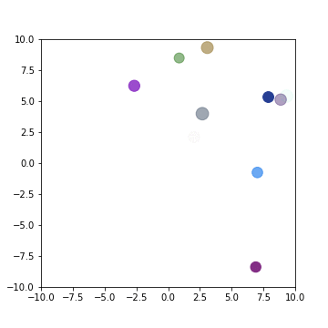

# Bouncing Balls

Plotting and animations with matplotlib.

Challenge:

- Change the markers to hexagons
- Add wind
- Add gravity

etc. the possibilities are endless!

This could also be developed into a very crude model of a gas.

**A better method - DES**

A better method is to use a discreet event simulation as opposed to this time driven one.
You would need to calcualte the times when significant events occur (when the ball hits the wall).

This is better than the current time driven model because the ball could have hit the wall before our next time step deltaT.
This introduces some error everytime the ball hits the wall.
Although we can reduce this with a small deltT it will never give us an exact solution like a DES model would.

