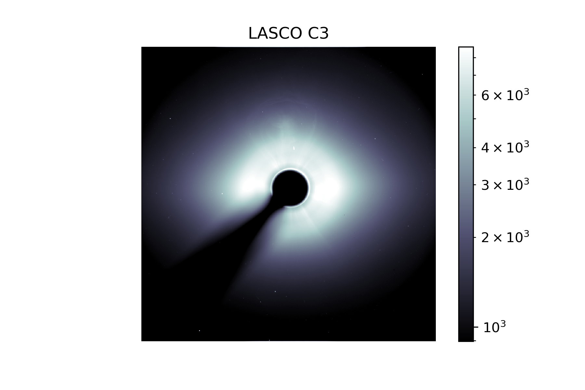

# Solar Images

Getting data from SDO and SOHO using the SunPy module.

**solarImages.py** creates all the images.

The lasco data is separate because it's not in the standard FITS format.

Some images you can make with the code:

