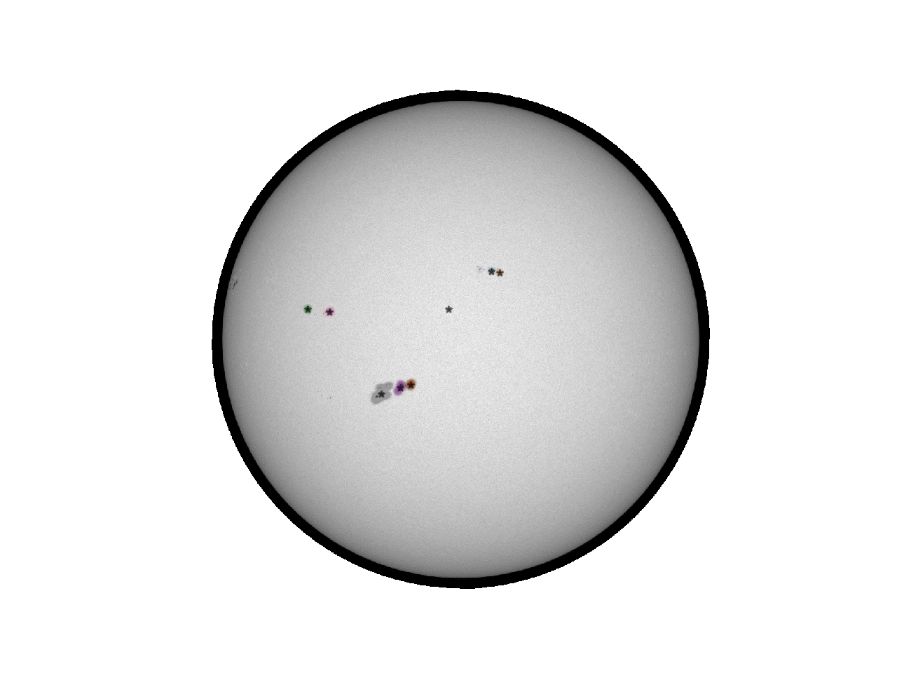
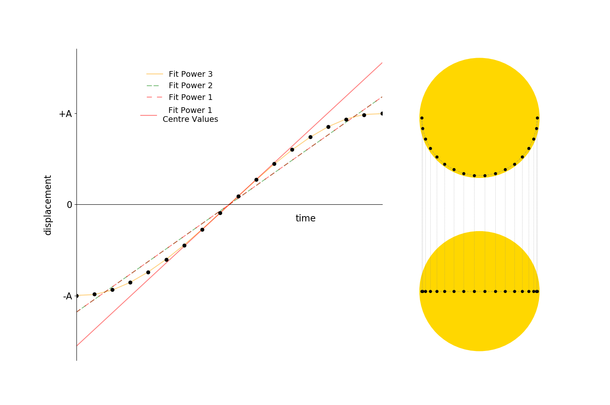

# Sunspots

Identification of sunspots in SDO HMI continuum images.  
Calculation of the sidereal and synodic rotation periods of the sun.  
Automatic identification and tracking of sunspots.

**sunspots.ipynb** will let students calculate the rotation period of the sun using interactive SDO images.

**theorySunspots.ipynb** explores some of the theory/maths behind the sunspots motion. The non-interactive **theorySunspots.py** creates the figures prefixed with ***theory***.

All the SDO HMI images are in the ***images*** directory.  
The ***data*** directory contains data from **sunspotsAuto.py**.

**sunspotsAuto.py** lets you automatically identify sunspots in an image using **stara.py** (from [Cadair](https://github.com/Cadair/sunspot_experiments/blob/master/stara.py)) and also create tracks/paths  of the sunspots over time and uses the tracks to calcualte the sideral rotation period at different latitudes.

Gif of sunspots identified with **sunspotsAuto.py** and **stara.py**. Sunspot centers (stars) are identified using ***scikit-learn*** DBS Clustering. Notice how the sunspot can appear in one image and dissapear in the next as identified by scikit-learn - perhaps a better clustering algorithim could be used? (hierachical/agglomarate clustering?)

Final output of **sunspotsAuto.py**, each point is a possible sunspot track. Colours are based on the max residual value from the fits plotted. This run was with a pretty wide positional cut and high max residual cut.

Figure created by **theorySunspots.py**.

