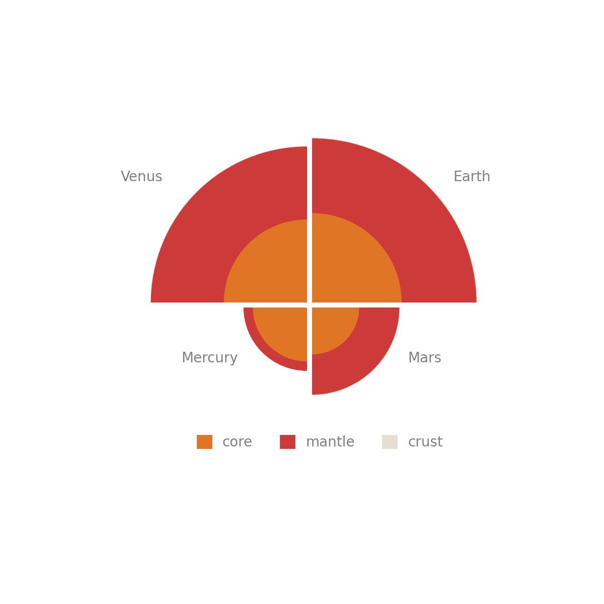
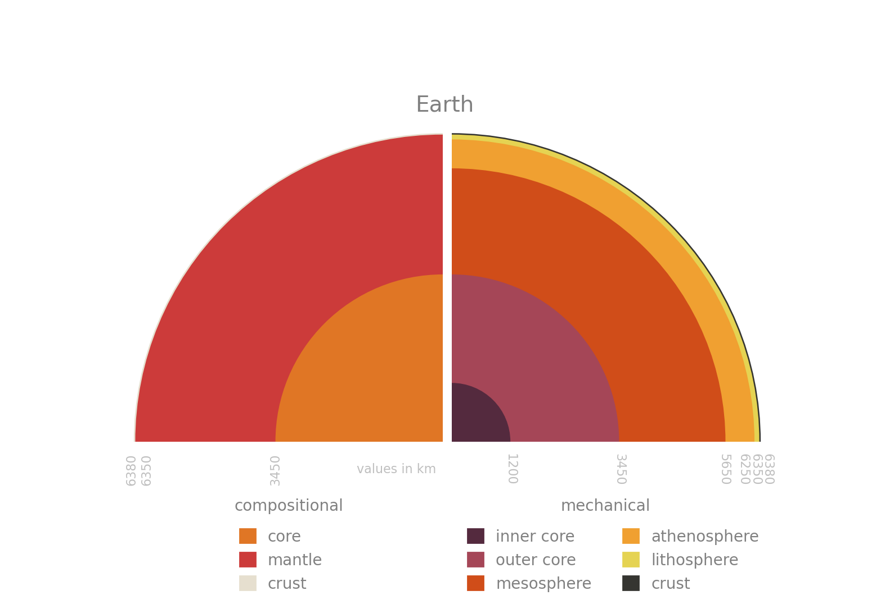
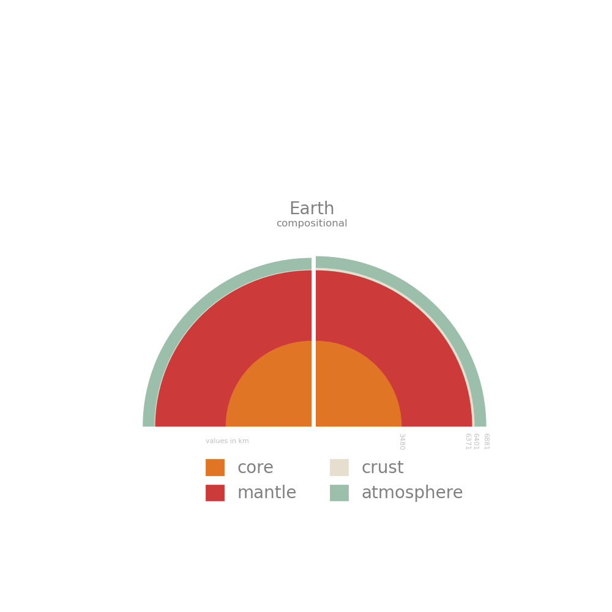
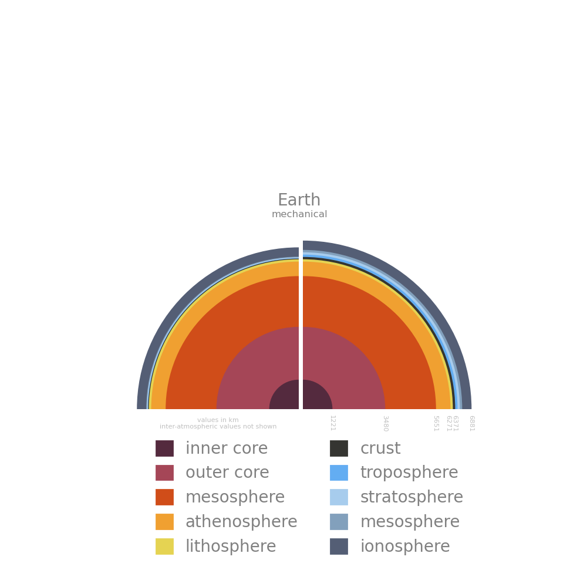

# Planetary Interiors

## COMINGSOON.ipynb
## AIM - COMING SOON

**Predict**

Have a think about these questions and make some predictions! Be sure to tell someone else what you predict.

1)      
2)     
3)   

## Intro

COMING SOON

**structure_plots.py** makes all the plots in the ***figures*** directory (minus the geotherm figure).

**thermal.py** makes the figure of the Earth's thermal gradient (geotherm figure).

# Data Files

## structure.csv

Adapted from - Eleanor Lutz, Tabletop Whale, https://github.com/eleanorlutz/topography_atlas_of_space

Data on the thickness of layers in the planets.  
***object*** - name of object  
***color*** - hex colour (for plotting)  
***layer_type*** - ```'compositional'``` or ```'mechanical'``` (NA for Gas Giants)  
***atm*** - ```'y'``` or ```'n'``` is the layer an atmospheric layer  
***name*** - name of layer  
***color_simp and name_simp*** - simplified names and colours for multiplanet plotting (leads to less legend entries)  
***depth_order*** - layer number with 0 for the core  
***depth*** - height/depth of that layer (km)  
***depth_from_core*** - the distance from the centre of the object to the top of the current layer (km)  
***reference*** - reference for the data (Earth data not too sure on taken from hyperphysics mainly)  

Note Venus and the Gas Giants have no mechanical entries in the csv.
Colours are chosen so the plots look nice.
Earth radius is just aboe the actual radius if you google it but this is because the Earth isn't a perfect sphere and I used a value for continental crust in the csv not oceanic (which is ~10 km not 30 km).

## geotherm.csv

Data taken from - Professor Bob Downs, University of Arizona, https://www.geo.arizona.edu/xtal/geos306/fall06-10.htm

Used to construct/plot the Earth's geothermal gradient.  
***r*** - depth (km)  
***r\****- distance from the center of the Earth (km)  
***T*** - temperature at r (K)  

I have altered the T profile from the original to be consistent with the D" layer depth (In the original file the core mantle boundary temp change occurred at too low a depth). The original data is in **geotherm_original.csv**.

## pressure.csv

Data taken from - Professor Bob Downs, University of Arizona, https://www.geo.arizona.edu/xtal/geos306/fall06-10.htm

Used to construct the pressure gradient.  
***r*** - depth (km)  
***r\****- distance from the center of the Earth (km)  
***P*** - pressure at r (GPa)  

# Outputs

Do not make **structure_plots.py** create all the figures as once as it might overplot some axes and give a matplotlib depreciation warning.

Interior Comparisons (Compositional Layers)


Compositional and Mechanical Layers Comparison


Compositional Layers (right side is adjusted so all layers are visible)


Mechanical Layers (right side is adjusted so all layers are visible)


Geothermal Gradient of the Earth
