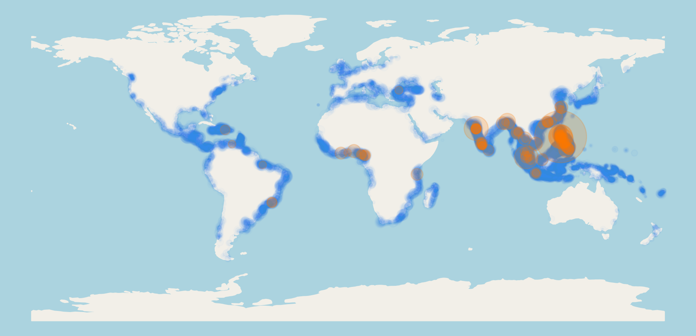
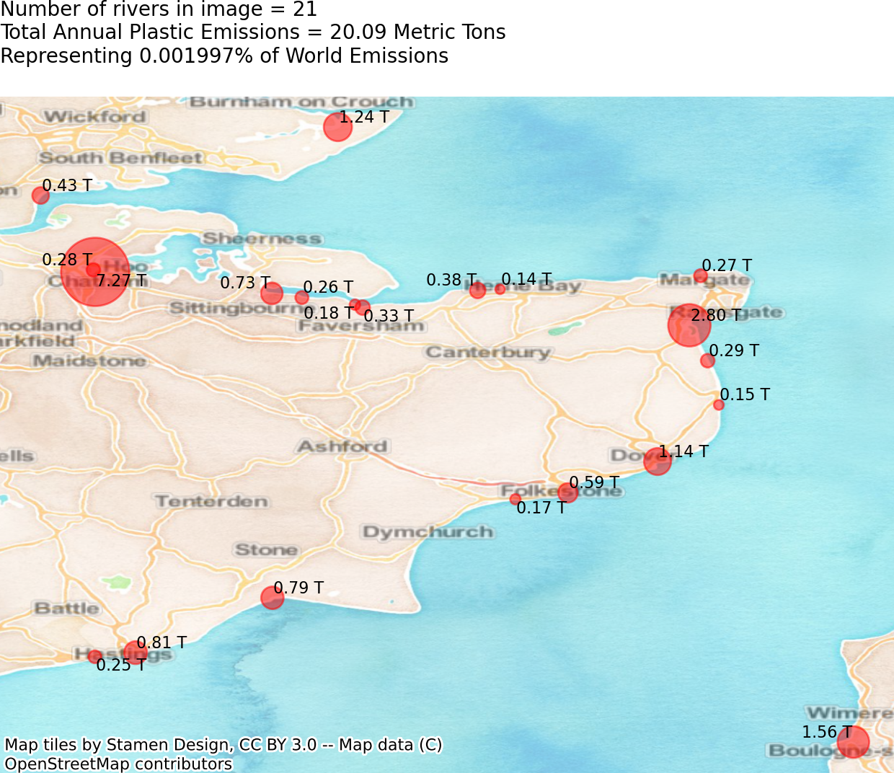

# Team Seas - River Pollution

## team_seas.ipynb
## AIM - To analyse plastic discharge by rivers using data from the Ocean Cleanup Project
Difficulty: Easy

## Intro

This activity is inspired by the work of the <a href="https://theoceancleanup.com/">Ocean Cleanup Project</a> and #TeamSeas started by YouTubers <a href="https://www.youtube.com/watch?v=cV2gBU6hKfY">MrBeast</a> and <a href="https://www.youtube.com/watch?v=pXDx6DjNLDU">Mark Rober</a>. It uses data from Meijer L. J. J. et al., 2021, <em>Sci. Adv.</em>, More than 1000 rivers account for 80% of global riverine plastic emissions into the ocean, DOI: <a href="10.1126/sciadv.aaz5803">10.1126/sciadv.aaz5803</a> which is provided <a href="https://figshare.com/articles/dataset/Supplementary_data_for_More_than_1000_rivers_account_for_80_of_global_riverine_plsatic_emissions_into_the_ocean_/14515590">here</a> and has been downloaded into the **Meijer2021_midpoint_emissions** directory for this activity.

Explore the Ocean Cleanup Projects' interactive map version of this data on their website <a href="https://theoceancleanup.com/sources/">here</a>.

You can see the full #TeamSeas campaign to remove plastic from the Ocean <a href="https://teamseas.org/">here</a> (I am in no way affiliated with any campaigns or organisations listed above).

Students create maps of their local area showing river pollution and analyse rivers by country. Some example figures are shown below and stored in the **Figures** directory.

    

    

## Sharing

If you share, use or modify this activity in any way use the citation in this [txt file](https://github.com/astroDimitrios/Astronomy/blob/master/CITATION.txt).    
Please contact me at astrodimitrios@gmail.com with any suggestions, mistakes found, or general questions about teaching astronomy with Python.

© Dimitrios Theodorakis GNU General Public License v3.0 
https://github.com/astroDimitrios/Astronomy  